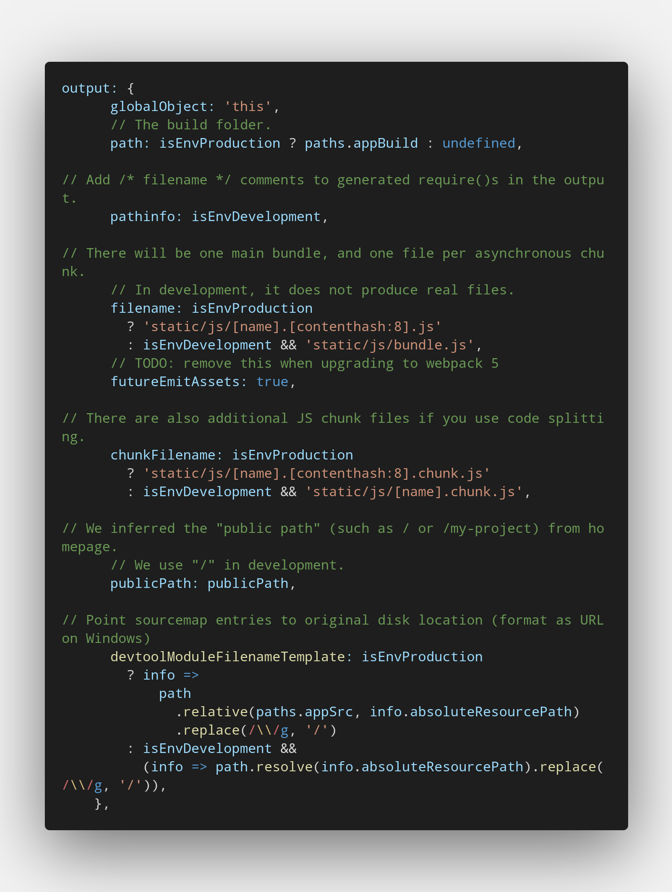

# [UI Eyechecker]

Created with ReactJS, based on [Paper Dashboard React](https://github.com/creativetimofficial/paper-dashboard-react/archive/master.zip) with the combination of [Material-UI](https://material-ui.com). This repo contains only the front-end of this project, for the full usage you need to first install and configure the next [repo](https://github.com/CallmeTorre/api-eyechecker).

## How to run

```
$ git clone https://github.com/Gushley110/ui-eyechecker.git
$ cd ui-eyechecker
$ npm install
$ npm start
```

If you encounter a problem while showing the PDF file, you need to change **webpack.config.js** located at **node_modules/react-scripts/config/**. Find the output property and add 
```
globalObject: 'this'
```
it should look like this



In development Hot Reload forces a re-render on the project when it detects a change in the files, when generating a PDF theres a change of files, so there is a not wanted re-render, to prevent this behavior and for the app to work as expected please disable Hot reload as it's shown [here](https://github.com/facebook/create-react-app/issues/2519#issuecomment-318867289). 